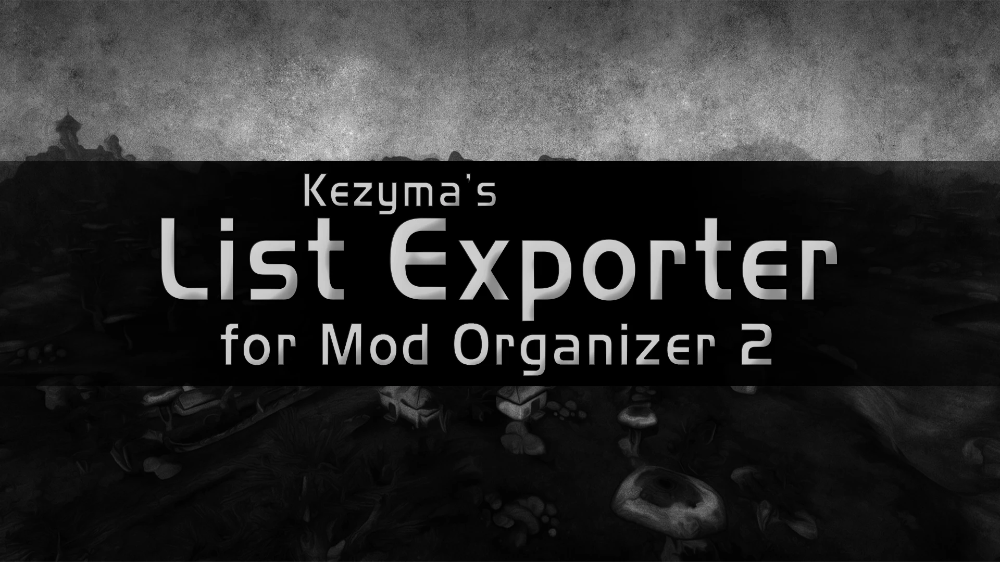
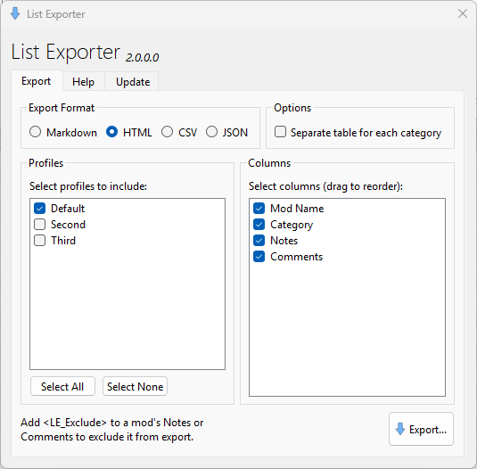
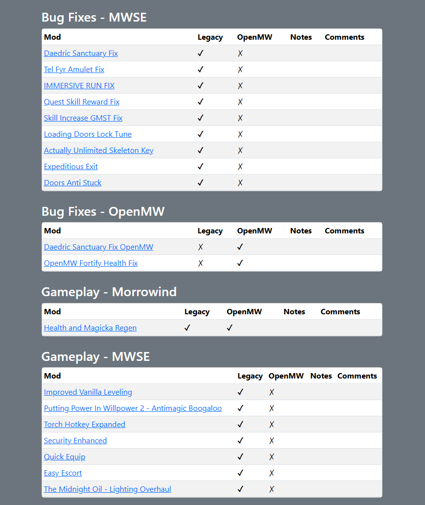
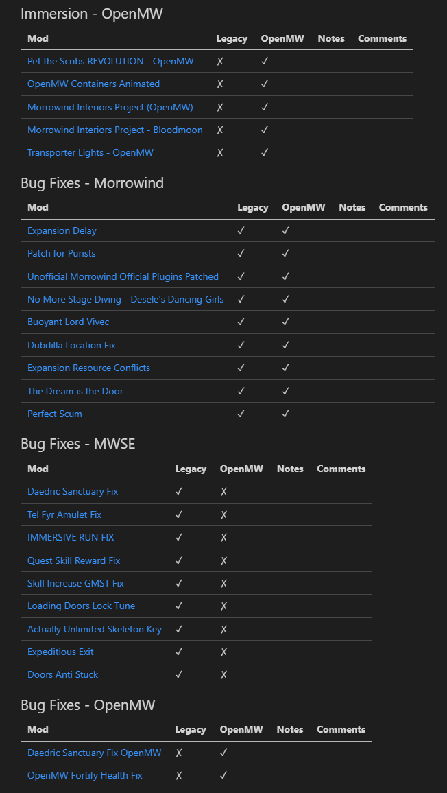
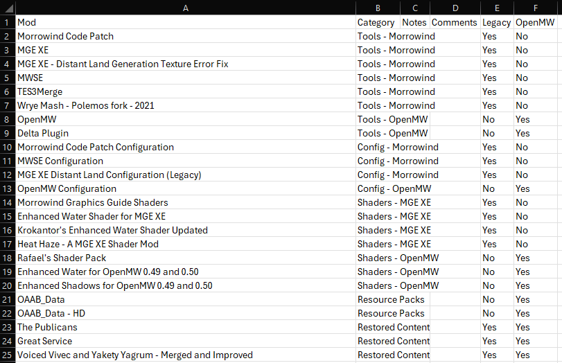
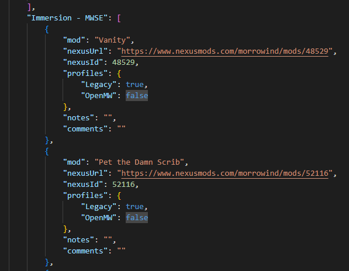

List Exporter is a plugin for Mod Organizer 2 that exports your mod list to various formats for sharing or documentation purposes.

- [Features](#features)
- [Installation](#installation)
- [Usage](#usage)
  - [Export Format](#export-format)
  - [Options](#options)
  - [Profile Selection](#profile-selection)
  - [Column Selection](#column-selection)
  - [Excluding Mods](#excluding-mods)
  - [Exporting](#exporting)
- [Export Format Details](#export-format-details)
- [Settings](#settings)
- [Troubleshooting](#troubleshooting)
- [Uninstallation](#uninstallation)

## Features

- Export mod lists to HTML, Markdown, CSV, or JSON formats
- Include mods from multiple profiles in a single export
- Organize exports by category using separators
- Choose which columns to include and customize their order
- Automatically generate NexusMods links for mods with valid mod IDs
- Exclude specific mods from exports using a tag

## Installation

Download List Exporter from [Nexus Mods](https://www.nexusmods.com/site/mods/1613) or [GitHub](https://github.com/Kezyma/ModOrganizer-Plugins/releases/tag/listexporter).

Extract the `listexporter` folder from the zip file and place it in Mod Organizer's plugins folder:
- Example: `C:\Mod Organizer\plugins\listexporter\`

Inside the folder you should find:
- A `shared` folder
- A `listexporter` folder
- A file called `__init__.py`

List Exporter will start the next time you run Mod Organizer.

Alternatively, install through [Plugin Finder](pluginfinder.md).

## Usage

Open List Exporter from the Tools menu in Mod Organizer.

### Export Format

Select the output format:
- **HTML**: Styled web page with Bootstrap, ideal for sharing online or viewing in a browser
- **Markdown**: Plain text tables for GitHub, Discord, forums, or README files
- **CSV**: Spreadsheet format compatible with Excel, Google Sheets, or other applications
- **JSON**: Structured data format for programmatic use or data processing

### Options

Enable **Separate table for each category** to create multiple tables organized by separator mods. When disabled, all mods appear in a single table with a Category column.

### Profile Selection

Select one or more profiles to include. A mod is included if enabled in *any* selected profile. When multiple profiles are selected, additional columns show enabled/disabled status for each profile.

Use **Select All** and **Select None** buttons for quick selection.

### Column Selection

Choose which columns to include by checking/unchecking them in the list. **Drag columns to reorder them** - the export uses the order shown.

Available columns:
- **Mod Name**: Mod name, hyperlinked to NexusMods if a mod ID is available (in HTML/Markdown)
- **Category**: The separator/category the mod belongs to (only when not using separate tables)
- **Notes**: Notes from the mod's meta.ini file
- **Comments**: Comments from the mod's meta.ini file
- **Nexus ID**: Numeric mod ID from NexusMods (CSV only)
- **Nexus URL**: Full NexusMods URL (CSV only)
- **Profile columns**: When multiple profiles are selected, shows enabled status per profile

### Excluding Mods

To exclude a mod from all exports, add `<LE_Exclude>` anywhere in the mod's Notes or Comments field in Mod Organizer. The tag is not case-sensitive.

This is useful for hiding utility mods, merged patches, or other mods you don't want in shared lists.

### Exporting

Click **Export** to generate your mod list. Choose a save location and filename; the appropriate file extension is added automatically.

## Export Format Details

### HTML

Creates a complete HTML page with Bootstrap styling, responsive tables, styled category headers (if using separate tables), and clickable NexusMods links.

### Markdown

Generates Markdown-formatted tables that render on GitHub, GitLab, Discord, Reddit, and many forums. Category headers use Markdown heading syntax.

### CSV

Produces comma-separated values compatible with Excel, Google Sheets, LibreOffice Calc, or any spreadsheet application. Categories appear as header rows when separated.

When CSV format is selected, additional columns become available:
- **Nexus ID**: The numeric mod ID from NexusMods
- **Nexus URL**: The full URL to the mod on NexusMods

These columns are useful for preserving Nexus information in spreadsheets, since CSV cannot include hyperlinks like HTML and Markdown.

### JSON

Outputs structured JSON data. When using separate categories, the JSON is organized by category. Includes Nexus ID and URL data when available. Ideal for developers processing mod lists programmatically.

## Settings

| Setting | Default | Description |
|---------|---------|-------------|
| `enabled` | `true` | Enables or disables List Exporter |
| `defaultformat` | `html` | Default export format. Valid values: html, markdown, csv, json |
| `separatecategories` | `false` | Whether to separate tables by category by default |

## Troubleshooting

### Mod names don't have Nexus links

Nexus links require a valid mod ID in meta.ini. Mods installed manually or from non-Nexus sources won't have this information.

### Categories are wrong or missing

Categories are determined by separator mods (mods ending in `_separator`). Ensure separators are properly named and positioned.

### Some mods are missing from export

Check if missing mods have `<LE_Exclude>` in their Notes or Comments. Also verify mods are enabled in at least one selected profile.

## Uninstallation

To remove List Exporter, delete:
- `plugins\listexporter\`
- `plugins\data\listexporter\`

If Mod Organizer is at `C:\Mod Organizer\`, delete:
- `C:\Mod Organizer\plugins\listexporter\`
- `C:\Mod Organizer\plugins\data\listexporter\`
