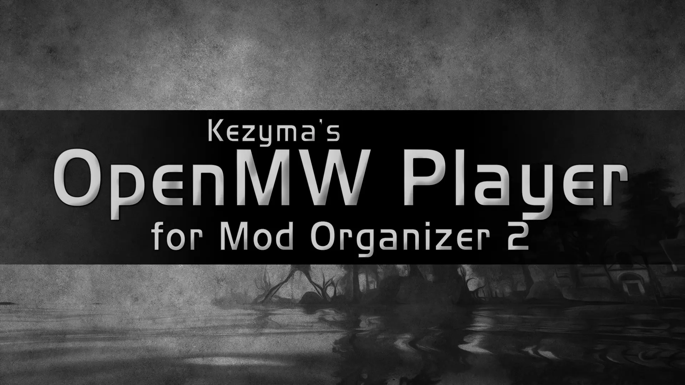
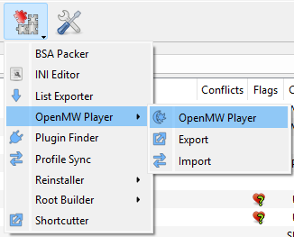
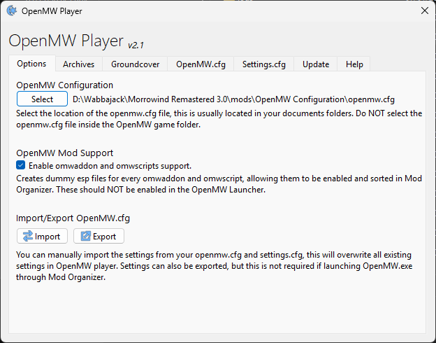
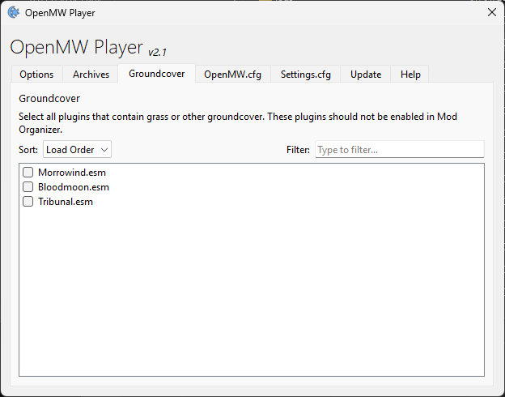
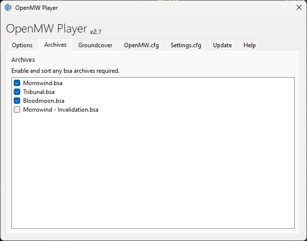
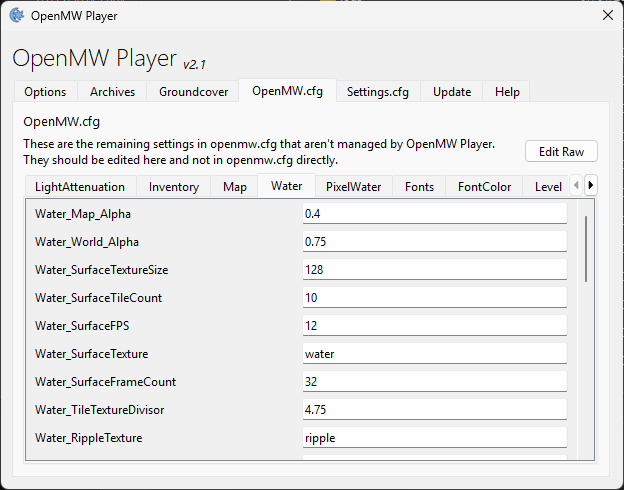
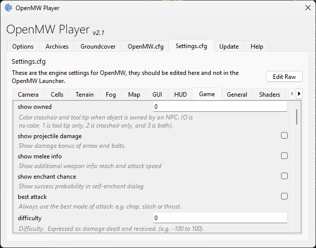

OpenMW Player is a plugin for Mod Organizer 2 that automatically exports your mod list, enabled plugins, and grass mods to OpenMW whenever you run the game through Mod Organizer.

- [Features](#features)
- [Installation](#installation)
  - [Setting Up OpenMW](#setting-up-openmw)
- [Usage](#usage)
  - [How Configuration Works](#how-configuration-works)
  - [Options Tab](#options-tab)
  - [Groundcover Tab](#groundcover-tab)
  - [Archives Tab](#archives-tab)
  - [OpenMW.cfg Tab](#openmwcfg-tab)
  - [Settings.cfg Tab](#settingscfg-tab)
  - [Raw Text Editing](#raw-text-editing)
  - [Import and Export](#import-and-export)
- [Settings](#settings)
- [Troubleshooting](#troubleshooting)
- [Uninstallation](#uninstallation)

## Features

- Run OpenMW through Mod Organizer with your current mod list and plugins
- Specify groundcover mods with different setups for each profile
- Select the OpenMW.cfg location to update with your mod list
- Manage omwaddon and omwscripts files using dummy esp files
- Per-profile configuration for openmw.cfg and settings.cfg
- Edit raw configuration files directly
- Filter and sort groundcover plugins

## Installation

Download OpenMW Player from [Nexus Mods](https://www.nexusmods.com/morrowind/mods/52345) or [GitHub](https://github.com/Kezyma/ModOrganizer-Plugins/releases/tag/openmwplayer).

Extract the `openmwplayer` folder from the zip file and place it in Mod Organizer's plugins folder:
- Example: `C:\Mod Organizer\plugins\openmwplayer\`

Inside the folder you should find:
- A `shared` folder
- An `openmwplayer` folder
- A file called `__init__.py`

OpenMW Player will start the next time you run Mod Organizer.

Alternatively, install through [Plugin Finder](pluginfinder.md) or use the [Mod Organizer Setup Tool](https://www.nexusmods.com/site/mods/599).

### Setting Up OpenMW

Add `OpenMW.exe` and/or `OpenMW-Launcher.exe` to Mod Organizer's executables list. When `OpenMW.exe`, `OpenMW-CS.exe`, or `OpenMW-Launcher.exe` are run through Mod Organizer, your mod list and enabled plugins are automatically applied to OpenMW.

## Usage

OpenMW Player stores copies of `openmw.cfg` and `settings.cfg` for each profile in Mod Organizer 2. Each profile has separate configuration.

Open OpenMW Player from the Tools menu in Mod Organizer.

### How Configuration Works

- **openmw.exe** launched through MO2: Uses config files from the current profile. If profile-specific saves are enabled, OpenMW saves to the profile (must launch directly, not through OpenMW Launcher)
- **Other OpenMW executables**: Original configs are backed up and replaced with profile configs; restored when the executable closes

### Options Tab

- **Config Path**: Select the location of your `openmw.cfg` file
- **Dummy ESP**: Enable to create dummy esp files for `.omwaddon` and `.omwscripts` files, allowing them to be enabled/disabled and sorted in Mod Organizer
- **Import/Export**: Import settings from or export settings to the selected OpenMW config

When dummy ESP is enabled, matching esp files are created for omwaddon and omwscripts files. These can be managed in Mod Organizer's plugins panel, and the corresponding OpenMW files are enabled when the game runs.

Dummy files are created:
- When the setting is enabled
- When Mod Organizer starts
- When a mod is enabled or disabled
- When a mod is installed

### Groundcover Tab

Select which esp files should be used for groundcover. These should **not** be enabled in the normal plugins panel. You must also enable groundcover in `settings.cfg`.

**Filtering and Sorting:**
- Use the **Filter** box to search for groundcover plugins by name
- Use the **Sort** dropdown to arrange by:
  - **Load Order**: Current load order position
  - **A-Z**: Alphabetical ascending
  - **Z-A**: Alphabetical descending

### Archives Tab

Select which BSA archives to use and their load order. Check archives to enable them and drag to reorder. The order determines which archive takes priority when files conflict.

### OpenMW.cfg Tab

Manage settings from `openmw.cfg` organized by category tabs. Add, modify, or remove configuration entries that control OpenMW behavior.

### Settings.cfg Tab

Manage settings from `settings.cfg` (OpenMW Launcher settings). Boolean settings display as checkboxes, others as text fields.

When available, comments from `settings.cfg` are displayed in gray italics below each setting, providing helpful descriptions.

### Raw Text Editing

Both the OpenMW.cfg and Settings.cfg tabs include an **Edit Raw** button that opens a text editor for direct file editing. This is useful for:
- Making bulk changes
- Adding settings not shown in the UI
- Copying configuration from other sources
- Troubleshooting configuration issues

After saving, the UI refreshes to reflect changes.

### Import and Export

- **Export**: Overwrites the current `openmw.cfg` and `settings.cfg` with profile settings, allowing OpenMW to run outside Mod Organizer with the current setup
- **Import**: Overwrites profile settings with the selected OpenMW config files

## Settings

| Setting | Default | Description |
|---------|---------|-------------|
| `enabled` | `true` | Enables or disables OpenMW Player |
| `openmwcfgpath` | Default path | Path to `openmw.cfg` |
| `dummyesp` | `false` | Enables omwaddon and omwscripts support via dummy esp files |

## Troubleshooting

### Settings not saving

Ensure the openmw.cfg path is correctly configured in the Options tab.

### Archives not loading

Verify the archive order and ensure archives are enabled in both OpenMW Player and your mod list.

### Groundcover not appearing

Check that groundcover plugins are enabled in the Groundcover tab and properly sorted. Ensure groundcover is enabled in settings.cfg.

## Uninstallation

To remove OpenMW Player, delete:
- `plugins\openmwplayer\`
- `plugins\data\openmwplayer\`

If Mod Organizer is at `C:\Mod Organizer\`, delete:
- `C:\Mod Organizer\plugins\openmwplayer\`
- `C:\Mod Organizer\plugins\data\openmwplayer\`
