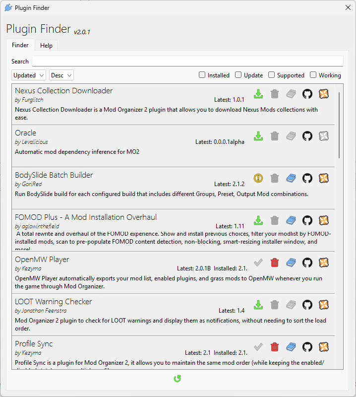

# Plugin Finder

Plugin Finder is a plugin for Mod Organizer 2 that allows users to browse and install other Mod Organizer plugins.

## Table of Contents

- [Features](#features)
- [Installation](#installation)
- [Usage](#usage)
  - [Browsing Plugins](#browsing-plugins)
  - [Filtering and Sorting](#filtering-and-sorting)
  - [Installing Plugins](#installing-plugins)
  - [Updating Plugins](#updating-plugins)
  - [Uninstalling Plugins](#uninstalling-plugins)
- [Adding Your Plugin](#adding-your-plugin)
  - [Using the Generator](#using-the-generator)
  - [Manual Creation](#manual-creation)
  - [Submitting Your Plugin](#submitting-your-plugin)
- [Settings](#settings)
- [Troubleshooting](#troubleshooting)
- [Uninstallation](#uninstallation)

## Features

- Browse a curated list of plugins and search by name
- Filter plugins by installation status, updates, or compatibility
- Install plugins directly within Mod Organizer
- Check for updates to installed plugins
- Remove plugins from within Plugin Finder
- View version information and compatibility status

> **Note:** Plugins found within Plugin Finder are produced and maintained by independent mod authors and may vary in quality. Issues with plugins should be directed to the respective plugin author.

## Installation

Download Plugin Finder from [Nexus Mods](https://www.nexusmods.com/skyrimspecialedition/mods/59869) or [GitHub](https://github.com/Kezyma/ModOrganizer-Plugins/releases/tag/pluginfinder).

Extract the `pluginfinder` folder from the zip file and place it in Mod Organizer's plugins folder:
- Example: `C:\Mod Organizer\plugins\pluginfinder\`

Inside the folder you should find:
- A `shared` folder
- A `pluginfinder` folder
- A file called `__init__.py`

Plugin Finder will start the next time you run Mod Organizer.

Alternatively, use the [Mod Organizer Setup Tool](https://www.nexusmods.com/site/mods/599) to install Mod Organizer with Plugin Finder included.

## Usage

Open Plugin Finder from the Tools menu in Mod Organizer.



### Browsing Plugins

The main list shows all available plugins with:
- Status indicators (installed, update available, compatibility)
- Version information (installed and latest)
- Author name
- Description
- Links to GitHub, NexusMods, and documentation

### Filtering and Sorting

**Search:** Type in the search box to filter plugins by name.

**Filter options:**
- **Installed**: Show only installed plugins
- **Updates**: Show only plugins with available updates
- **Supported**: Show only plugins tested with your MO2 version
- **Working**: Show only plugins confirmed working with your MO2 version

**Sorting:** Use the sort dropdown to arrange plugins by name (ascending or descending).

### Installing Plugins

1. Find the plugin you want to install
2. Click the **Install** button on the plugin entry
3. Restart Mod Organizer when prompted

### Updating Plugins

Plugins with available updates show an update indicator. Click the **Update** button to download and install the latest version. Restart Mod Organizer to apply the update.

### Uninstalling Plugins

Click the **Uninstall** button on an installed plugin to remove it.

> **Note:** Plugin Finder cannot uninstall itself.

## Adding Your Plugin

To add your plugin to Plugin Finder, create a JSON manifest file containing plugin information and version details.

### Using the Generator

The easiest way to create a manifest is using the [Plugin Finder JSON Generator](https://kezyma.github.io/index.html?p=pluginfinder-generator).

### Manual Creation

Create a JSON file with the following structure:

```json
{
  "Name": "Plugin Name",
  "Author": "Your Name",
  "Description": "Short description (max 350 characters)",
  "DocsUrl": "https://example.com/docs",
  "NexusUrl": "https://www.nexusmods.com/...",
  "GithubUrl": "https://github.com/...",
  "Versions": [
    {
      "Version": "1.0.0",
      "Released": "2024-01-15",
      "MinSupport": "2.4.2",
      "MaxSupport": "2.5.0",
      "MinWorking": "",
      "MaxWorking": "",
      "ReleaseNotes": ["Initial release"],
      "DownloadUrl": "https://github.com/.../plugin.1.0.0.zip",
      "PluginPath": ["pluginname"],
      "LocalePath": [],
      "DataPath": ["data/pluginname"]
    }
  ]
}
```

#### Plugin Fields

| Field | Required | Description |
|-------|----------|-------------|
| `Name` | Yes | Display name (should not change once added) |
| `Author` | Yes | Author name to display |
| `Description` | No | Short description (max 350 characters) |
| `DocsUrl` | No | URL to documentation |
| `NexusUrl` | No | URL to Nexus page |
| `GithubUrl` | No | URL to GitHub page |
| `Versions` | No | Array of installable versions |

#### Version Fields

| Field | Required | Description |
|-------|----------|-------------|
| `Version` | Yes | Version number (matching MO2 settings display format) |
| `Released` | Yes | Release date (yyyy-MM-dd format) |
| `MinSupport` | No | Minimum tested MO2 version (warning shown for earlier) |
| `MaxSupport` | No | Maximum tested MO2 version (warning shown for later) |
| `MinWorking` | No | Minimum working MO2 version (blocks earlier) |
| `MaxWorking` | No | Maximum working MO2 version (blocks later) |
| `ReleaseNotes` | No | Array of release notes |
| `DownloadUrl` | Yes | Direct download URL to the zip file |
| `PluginPath` | Yes | Paths in zip to copy to plugins folder |
| `LocalePath` | No | Paths in zip to copy to translations folder |
| `DataPath` | No | Paths to delete on uninstall (relative to plugins folder) |

### Submitting Your Plugin

Host your JSON file on GitHub with your plugin, then submit it to Plugin Finder:

1. Open a pull request editing [plugin_directory.json](https://github.com/Kezyma/ModOrganizer-Plugins/blob/main/directory/plugin_directory.json)
2. Open an [issue](https://github.com/Kezyma/ModOrganizer-Plugins/issues) with your plugin name and JSON URL
3. Contact Kezyma on Discord: `Kezyma#7969`

## Settings

| Setting | Default | Description |
|---------|---------|-------------|
| `enabled` | `true` | Enables or disables Plugin Finder |
| `priority` | `120` | Priority of the installer module for installing plugins |

## Troubleshooting

### A plugin installed through Plugin Finder does not work

Plugins listed on Plugin Finder are maintained by their separate authors. If you have issues with a plugin, please check the documentation, GitHub and/or Nexus pages for the plugin.

### A plugin listed in Plugin Finder is out of date

Plugins listed on Plugin Finder are maintained by their separate authors. Please contact the author of the plugin and request they update their data for Plugin Finder.

### A plugin I installed manually isn't listed as the correct version

Plugin Finder attempts to detect the version based on the contents of the plugin, but this may not always be successful. When detection fails, a default version number is assigned. To remedy this, install or update the plugin through Plugin Finder.

### Updating or uninstalling a specific plugin always fails

Even if a message is logged that a file could not be moved/deleted, Plugin Finder will still attempt to move/delete those files when Mod Organizer restarts.

Sometimes plugin files are locked or marked as read-only. To resolve this issue, manually delete the plugin from Mod Organizer's plugins folder.

## Uninstallation

To remove Plugin Finder, delete:
- `plugins\pluginfinder\`
- `plugins\data\pluginfinder\`

If Mod Organizer is at `C:\Mod Organizer\`, delete:
- `C:\Mod Organizer\plugins\pluginfinder\`
- `C:\Mod Organizer\plugins\data\pluginfinder\`
