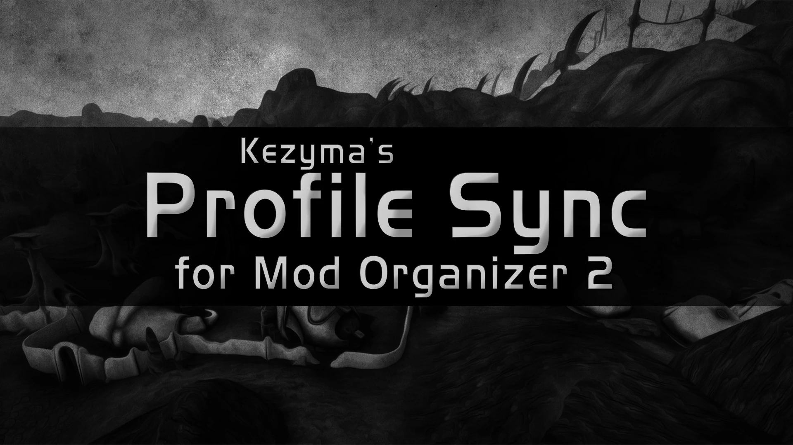
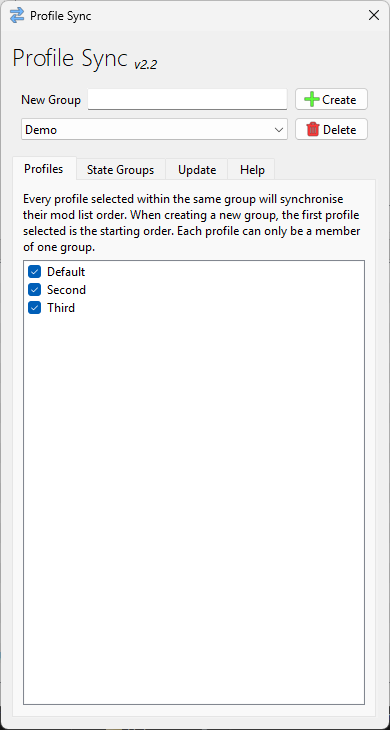
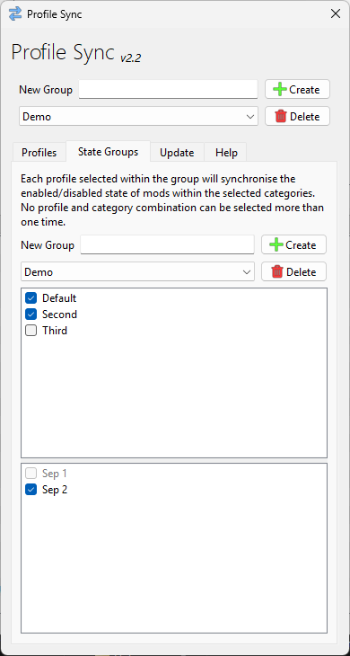

Profile Sync is a plugin for Mod Organizer 2 that allows you to synchronize mod configurations across multiple profiles.

- [Features](#features)
- [Installation](#installation)
- [Usage](#usage)
  - [Sync Groups](#sync-groups)
  - [Adding Profiles](#adding-profiles)
  - [State Groups](#state-groups)
  - [How Synchronization Works](#how-synchronization-works)
- [Settings](#settings)
- [Troubleshooting](#troubleshooting)
- [Uninstallation](#uninstallation)

## Features

- Keep mod order synchronized across multiple profiles
- Create multiple sync groups with different mod orders
- Define state groups with category-based synchronization
- Automatic sync when mods are installed, removed, enabled, disabled, or reordered
- Exclude individual profiles for testing and customization

## Installation

Download Profile Sync from [Nexus Mods](https://www.nexusmods.com/skyrimspecialedition/mods/60690) or [GitHub](https://github.com/Kezyma/ModOrganizer-Plugins/releases/tag/profilesync).

Extract the `profilesync` folder from the zip file and place it in Mod Organizer's plugins folder:
- Example: `C:\Mod Organizer\plugins\profilesync\`

Inside the folder you should find:
- A `shared` folder
- A `profilesync` folder
- A file called `__init__.py`

Profile Sync will start the next time you run Mod Organizer.

Alternatively, install through [Plugin Finder](pluginfinder.md) or use the [Mod Organizer Setup Tool](https://www.nexusmods.com/site/mods/599).

## Usage

Open Profile Sync from the Tools menu in Mod Organizer.

### Sync Groups

A sync group is a collection of profiles that share the same mod configuration. When you make changes to one profile in a sync group, those changes are automatically applied to all other profiles in the group.

**Creating a sync group:**
1. Enter a name in the text field
2. Click **Add**

**Managing sync groups:**
- Select a group from the dropdown to view/edit it
- Click **Delete** to remove the selected group

### Adding Profiles

Check profiles in the list to add them to the current sync group. A profile can only belong to one sync group at a time.

> **Important:** Add profiles in the correct order. There is no way to restore a lost mod order.

**How profiles are synchronized:**
- The first profile added to a group establishes the group's mod order
- Each subsequent profile added will have its mod order updated to match the group
- When the last profile is removed, the group's stored order is deleted

### State Groups

State groups allow you to create different configurations within a sync group. Each state can include different profiles and mod categories, giving you fine-grained control over what gets synchronized.

**Creating a state group:**
1. Switch to the State Groups tab
2. Add a new state group
3. Select which profiles belong to this state
4. Choose which mod categories should be synchronized for this state

### How Synchronization Works

- When you change the mod order in any profile within a sync group, the group's shared order is updated
- When you load or switch to a profile, that profile's mod order is updated to match the group
- Changes propagate automatically when mods are installed, removed, enabled, disabled, or reordered

Profile Sync only synchronizes the order of mods and separators. It does **not** change:
- Which mods are enabled or disabled (unless using state groups with category sync)
- Plugin load order

## Settings

| Setting | Default | Description |
|---------|---------|-------------|
| `enabled` | `true` | Enables or disables Profile Sync |
| `useasync` | `false` | Uses background threads for saving operations. May improve performance but can cause issues in some configurations |

## Troubleshooting

### The last change made is not synchronizing to other profiles

Profile Sync runs on specific events: when a mod is installed, removed, enabled/disabled, or reordered through drag and drop. If another action causes a change, it may not trigger a sync.

To force a sync, toggle the enabled state of any mod back and forth once.

### Sync is slow or causes lag

Profile Sync can use threaded operations for better performance. Enable the `useasync` setting in plugin settings.

### Some mods are not syncing

Verify that the mod's category is included in your state group configuration. Only categories selected for a state will be synchronized.

## Uninstallation

To remove Profile Sync, delete:
- `plugins\profilesync\`
- `plugins\data\profilesync\`

If Mod Organizer is at `C:\Mod Organizer\`, delete:
- `C:\Mod Organizer\plugins\profilesync\`
- `C:\Mod Organizer\plugins\data\profilesync\`
