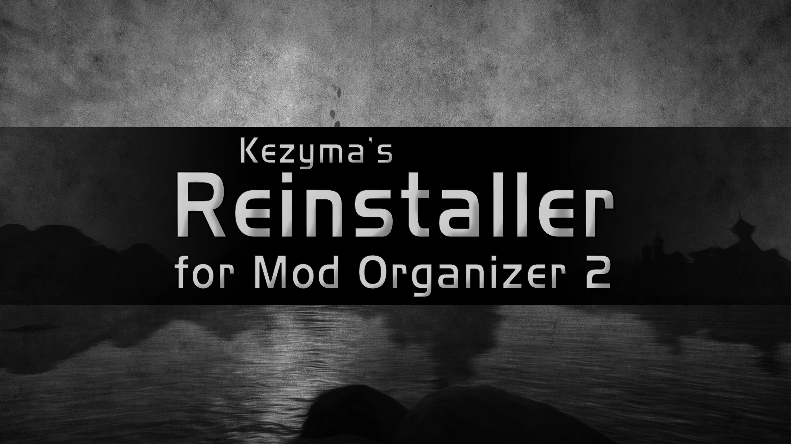
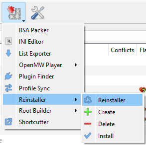
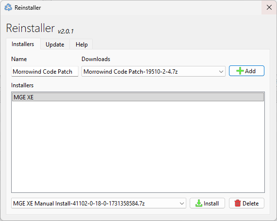

Reinstaller is a plugin for Mod Organizer 2 that allows users to back up downloaded mod installers and run them on demand.

- [Features](#features)
- [Installation](#installation)
- [Usage](#usage)
  - [Creating an Installer](#creating-an-installer)
  - [Running an Installer](#running-an-installer)
  - [Managing Installers](#managing-installers)
- [Tips](#tips)
- [Settings](#settings)
- [Troubleshooting](#troubleshooting)
- [Uninstallation](#uninstallation)

## Features

- Back up files from Mod Organizer's downloads folder
- Quickly install backed up files from a convenient menu
- Store multiple versions of the same mod
- Keep Mod Organizer's downloads folder clean
- Re-run FOMOD installers to change options

## Installation

Download Reinstaller from [Nexus Mods](https://www.nexusmods.com/skyrimspecialedition/mods/59292) or [GitHub](https://github.com/Kezyma/ModOrganizer-Plugins/releases/tag/reinstaller).

Extract the `reinstaller` folder from the zip file and place it in Mod Organizer's plugins folder:
- Example: `C:\Mod Organizer\plugins\reinstaller\`

Inside the folder you should find:
- A `shared` folder
- A `reinstaller` folder
- A file called `__init__.py`

Reinstaller will start the next time you run Mod Organizer.

Alternatively, install through [Plugin Finder](pluginfinder.md) or use the [Mod Organizer Setup Tool](https://www.nexusmods.com/site/mods/599).

## Usage

Reinstaller adds tools to Mod Organizer's Tools menu: quick buttons for Create, Install, and Delete, plus the main Reinstaller menu.

### Creating an Installer

1. Open the Reinstaller dialog from the Tools menu
2. Select a downloaded mod from the dropdown list
3. Enter a name for the installer (or use the default mod name)
4. Click **Add** to create the installer

The file is backed up and can be safely deleted from the downloads folder.

### Running an Installer

1. Select the installer from the list
2. If multiple versions exist, select the desired version from the dropdown
3. Click **Install** to run the installer
4. Complete the installation process (FOMOD options, etc.)

### Managing Installers

- **Delete**: Remove an installer you no longer need. If multiple versions exist, select the specific version first.
- **Version Selection**: Choose between different versions of the same mod using the dropdown

## Tips

- Create installers for mods with complex FOMOD options that you might want to change later
- Keep installers for mods you frequently reinstall or update
- The installer uses the original downloaded archive, so the backup maintains the original file
- Use Reinstaller to clean up your downloads folder while keeping important installers accessible

## Settings

| Setting | Default | Description |
|---------|---------|-------------|
| `enabled` | `true` | Enables or disables Reinstaller |

## Troubleshooting

### Installer not running

Ensure the backup file still exists in Reinstaller's data folder. If it has been deleted, you'll need to re-download the mod and create a new installer.

### Wrong version installing

Check the version dropdown to ensure you have the correct version selected before clicking Install.

### Mod not appearing in download list

Only mods in your Mod Organizer downloads folder will appear in the dropdown. Ensure the mod has been downloaded through Mod Organizer.

## Uninstallation

To remove Reinstaller, delete:
- `plugins\reinstaller\`
- `plugins\data\reinstaller\`

If Mod Organizer is at `C:\Mod Organizer\`, delete:
- `C:\Mod Organizer\plugins\reinstaller\`
- `C:\Mod Organizer\plugins\data\reinstaller\`
