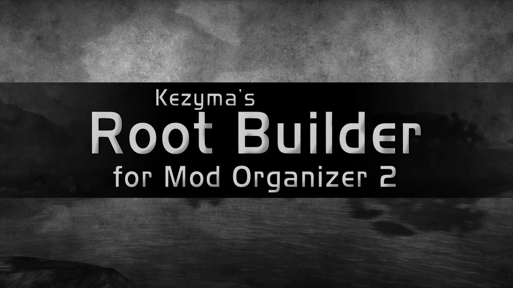
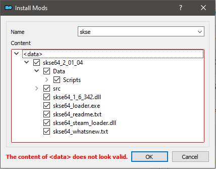
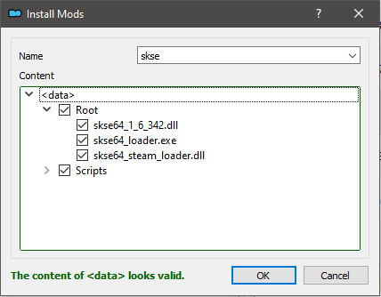
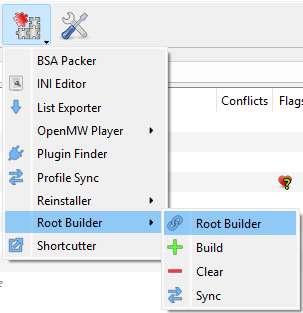
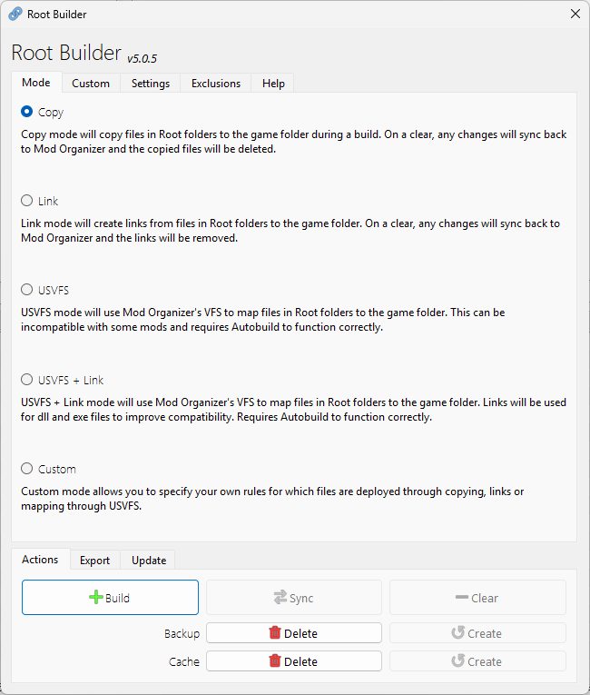
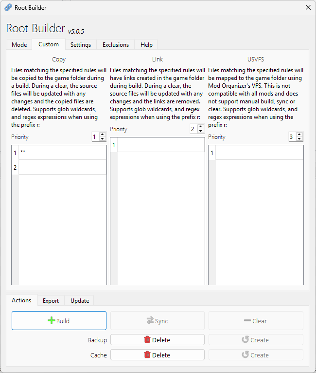
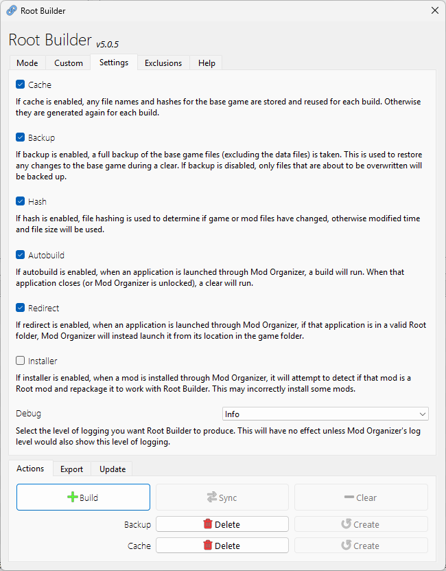
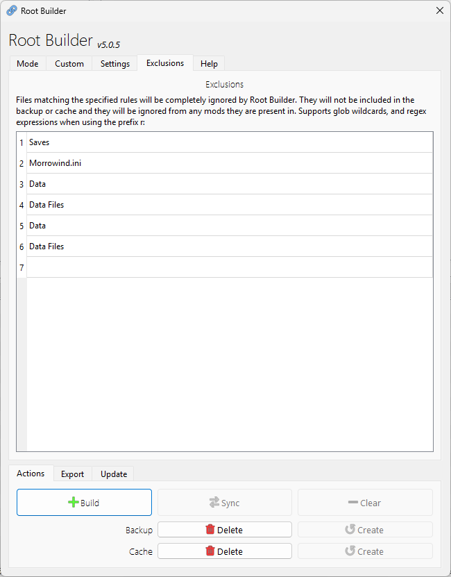

Root Builder is a plugin for Mod Organizer 2 that allows users to manage files in the base game directory through Mod Organizer.

## Table of Contents

- [Features](#features)
- [Installation](#installation)
- [Usage](#usage)
  - [Example: Installing SKSE](#example-installing-skse)
  - [Running Executables from Root Mods](#running-executables-from-root-mods)
- [Tools Menu](#tools-menu)
- [Main Menu](#main-menu)
  - [Mode Tab](#mode-tab)
  - [Custom Tab](#custom-tab)
  - [Settings Tab](#settings-tab)
  - [Exclusions Tab](#exclusions-tab)
  - [Actions Tab](#actions-tab)
  - [Export Tab](#export-tab)
- [Settings](#settings)
- [Deployment Methods](#deployment-methods)
- [Troubleshooting](#troubleshooting)
- [Uninstallation](#uninstallation)

## Features

- Install script extenders (SKSE, OBSE, FOSE, etc.) through Mod Organizer
- Install ENB and different presets through Mod Organizer
- Manage different versions of the same game as mods within Mod Organizer
- Keep your game folder clean and untouched
- Keep all your mods in Mod Organizer, preserving your setup for reinstalls or computer switches
- Multiple deployment modes: Copy, Link, USVFS, or Custom
- Automatic build and clear when launching games
- Backup and cache system to protect original game files

## Installation

Download Root Builder from [Nexus Mods](https://www.nexusmods.com/skyrimspecialedition/mods/31720) or [GitHub](https://github.com/Kezyma/ModOrganizer-Plugins/releases/tag/rootbuilder).

Extract the `rootbuilder` folder from the zip file and place it in Mod Organizer's plugins folder:
- Example: `C:\Mod Organizer\plugins\rootbuilder\`

Inside the folder you should find:
- A `shared` folder
- A `rootbuilder` folder
- A file called `__init__.py`

Root Builder will start the next time you run Mod Organizer.

Alternatively, you can install it through [Plugin Finder](pluginfinder.md) or use the [Mod Organizer Setup Tool](https://www.nexusmods.com/site/mods/599).

## Usage

To install mods to the base game folder, they need to be arranged with a special `Root` folder. Any files placed in a mod's `Root` folder will be present in the base game folder when Mod Organizer runs an application.

### Example: Installing SKSE

SKSE contains files that need to go into the base game folder (`skse64_1_6_342.dll`, `skse64_steam_loader.dll`, `skse_loader.exe`) and a `Scripts` folder that Mod Organizer can manage normally.

**Before (as downloaded):**

**After (arranged for Root Builder):**

Move the game folder files into a `Root` folder alongside the `Scripts` folder. The `Data` folder contents should be at the mod's root level (alongside the `Root` folder).

> **Important:** You cannot put a folder named `Data` inside the `Root` folder. If Root Builder detects a `Data` folder inside `Root`, the mod will be ignored entirely.

For mods containing only game folder files, Mod Organizer may warn that the mod doesn't look valid. This warning can be safely ignored.

### Running Executables from Root Mods

Once installed, enable the mod like any other. Add executables (like `skse_loader.exe`) to Mod Organizer's executables list from the mod folder:

- **Portable MO2:** `C:\Mod Organizer\mods\SKSE\Root\skse_loader.exe`
- **Non-portable MO2:** `%LOCALAPPDATA%\ModOrganizer\INSTANCE_NAME\mods\SKSE\Root\skse_loader.exe`

Root Builder will automatically redirect the executable to run from the game folder when launched.

## Tools Menu

Root Builder adds quick access items to the Tools menu:

- **Build**: Deploy root files to the game folder
- **Sync**: Update deployed files with current mod changes
- **Clear**: Remove all deployed root files and restore backups

> **Important:** Always run Clear after finishing any manual Build. Root Builder can encounter issues if the game receives an update before Clear is run.

## Main Menu

The Root Builder menu provides access to all settings and tools.

### Mode Tab

Select the deployment method for your root files. See [Deployment Methods](#deployment-methods) for details on each mode.

### Custom Tab

Configure custom deployment rules with file patterns and priority settings. Define glob patterns for which files should use Copy, Link, or USVFS methods, and set priorities to determine which method takes precedence when patterns overlap.

### Settings Tab

Configure Root Builder behavior:
- **Cache**: Cache base game files on first run for faster change detection
- **Backup**: Create full backup of game files that may be modified
- **Autobuild**: Automatically build when launching applications and clear when they close
- **Redirect**: Redirect exe files launched from mod folders to the game folder
- **Installer**: Enable automatic detection and installation of root mods
- **Hash**: Use file hashing for accurate change detection (slower but more reliable)

### Exclusions Tab

Define files and folders to exclude from Root Builder processing. Common exclusions include Saves, .ini files, and the Data folder. Mods containing excluded items in their Root folders will also be ignored.

### Actions Tab

Perform manual Root Builder operations:
- **Build**: Deploy root files to the game folder
- **Sync**: Check for changes and update deployed files
- **Clear**: Remove all deployed root files and restore backups
- **Create Backup**: Create a backup of base game files
- **Delete Backup**: Remove the backup
- **Create Cache**: Generate file hashes for change detection
- **Delete Cache**: Remove the cache

### Export Tab

Manage Root Builder settings:
- **Export**: Save current settings to a file for backup or sharing
- **Import**: Load settings from a file
- **Reset**: Restore default settings

## Settings

| Setting | Default | Description |
|---------|---------|-------------|
| `enabled` | `true` | Enables or disables Root Builder |
| `cache` | `true` | Stores hashes of base game files on first run for change detection |
| `backup` | `true` | Backs up all base game files on first run |
| `autobuild` | `true` | Automatically performs Build when launching an application and Clear when it closes |
| `redirect` | `true` | Redirects executables launched from mod root folders to run from the game folder |
| `installer` | `false` | Enables an installer plugin to automatically detect and repackage root mods during installation |
| `priority` | `110` | Priority of the installer module (only applies when installer is enabled) |
| `exclusions` | `Saves,Morrowind.ini,Data,Data Files` | Files and folders ignored by Root Builder |
| `hash` | `true` | Uses hashing as the method of change detection |
| `copyfiles` | `**` | Glob pattern for files that should be copied |
| `linkfiles` | *(empty)* | Glob pattern for files that should be hard-linked |
| `usvfsfiles` | *(empty)* | Glob pattern for files that should be mapped via USVFS |
| `copypriority` | `1` | Priority for copy method (lower = higher priority) |
| `linkpriority` | `2` | Priority for link method (lower = higher priority) |
| `usvfspriority` | `3` | Priority for USVFS method (lower = higher priority) |

## Deployment Methods

Root Builder supports multiple methods for deploying files:

### Copy Mode (Default)

Files are copied to the game folder. Most compatible option but requires disk space for duplicates.

**Configuration:** `copyfiles=**`

### Link Mode

Creates hard links instead of copying files. Saves disk space but requires NTFS filesystem and may not work with all games or applications.

**Configuration:** `linkfiles=**`, `copyfiles=`

### USVFS Mode

Files are mapped through Mod Organizer's virtual file system. No actual file changes occur, but this mode has compatibility issues with files that must be present at launch (exe, dll).

**Configuration:** `usvfsfiles=**`, `copyfiles=`

### USVFS + Link Mode

Hybrid approach using USVFS for most files but creating links for executables (.exe) and libraries (.dll) that must be physically present.

**Configuration:** `usvfsfiles=**`, `linkfiles=*.exe,*.dll`

### Custom Mode

Define your own rules using glob patterns and priorities. The `*files` settings determine which files use each method, and the `*priority` settings determine precedence when patterns overlap (lower number = higher priority).

## Troubleshooting

### Game files are being copied to the overwrite folder

Root Builder may not detect game updates correctly for all games. To fix this:
1. In the Actions tab, click Delete for both Backup and Cache
2. Re-run your game update (Root Builder may have reverted it)
3. In the Actions tab, click Create for both Backup and Cache

### Running Build, Sync or Clear is slow or freezes Mod Organizer

Root Builder can be slow with many files. To improve performance:
- Remove unnecessary files from Root folders (documentation, source code)
- Add large, unchanging game files to Exclusions
- Disable Hash in Settings (less accurate but faster)
- Disable Backup if game files won't be modified

### Root Builder is not functioning correctly on Linux

The autobuild functionality doesn't work on Linux. Run manual Build before launching applications and manual Clear after they close.

## Uninstallation

To remove Root Builder:

1. Run Clear to restore your game folder
2. Delete `plugins\rootbuilder\`
3. Delete `plugins\data\rootbuilder\`

If Mod Organizer is at `C:\Mod Organizer\`, delete:
- `C:\Mod Organizer\plugins\rootbuilder\`
- `C:\Mod Organizer\plugins\data\rootbuilder\`
