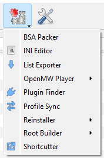

# Root Builder

Root Builder is a plugin for Mod Organizer 2 that allows users to manage files in the base game directory through Mod Organizer.

## Features

- Install script extenders (SKSE, OBSE, FOSE, etc.) through Mod Organizer
- Install ENB and different presets through Mod Organizer
- Manage different versions of the same game as mods within Mod Organizer
- Keep your game folder clean and untouched
- Keep all your mods in Mod Organizer, preserving your setup for reinstalls or computer switches

## Installation

Download Root Builder from [Nexus Mods](https://www.nexusmods.com/skyrimspecialedition/mods/31720) or [GitHub](https://github.com/Kezyma/ModOrganizer-Plugins/releases/tag/rootbuilder).

Extract the `rootbuilder` folder from the zip file and place it in Mod Organizer's plugins folder:
- Example: `C:\Mod Organizer\plugins\rootbuilder\`

Inside the folder you should find:
- A `shared` folder
- A `rootbuilder` folder
- A file called `__init__.py`

Root Builder will start the next time you run Mod Organizer.

Alternatively, you can install it through [Plugin Finder](pluginfinder.md) or use the [Mod Organizer Setup Tool](https://www.nexusmods.com/site/mods/599).

## Usage

To install mods to the base game folder, they need to be arranged with a special `Root` folder. Any files placed in a mod's `Root` folder will be present in the base game folder when Mod Organizer runs an application.

### Example: Installing SKSE

SKSE contains files that need to go into the base game folder (`skse64_1_6_342.dll`, `skse64_steam_loader.dll`, `skse_loader.exe`) and a `Scripts` folder that Mod Organizer can manage normally.

**Before (as downloaded):**

**After (arranged for Root Builder):**

Move the game folder files into a `Root` folder alongside the `Scripts` folder. The `Data` folder contents should be at the mod's root level (alongside the `Root` folder).

> **Important:** You cannot put a folder named `Data` inside the `Root` folder. If Root Builder detects a `Data` folder inside `Root`, the mod will be ignored entirely.

For mods containing only game folder files, Mod Organizer may warn that the mod doesn't look valid. This warning can be safely ignored.

### Running Executables from Root Mods

Once installed, enable the mod like any other. Add executables (like `skse_loader.exe`) to Mod Organizer's executables list from the mod folder:

- **Portable MO2:** `C:\Mod Organizer\mods\SKSE\Root\skse_loader.exe`
- **Non-portable MO2:** `%LOCALAPPDATA%\ModOrganizer\INSTANCE_NAME\mods\SKSE\Root\skse_loader.exe`

Root Builder will automatically redirect the executable to run from the game folder when launched.

## Tools

Root Builder adds items to the Tools menu:

### Build

Running a Build:
- Generates a list of all files in mod root folders
- (First run) Generates hashes and backups for base game files (excluding Data folder and exclusions)
- Deploys files from mod root folders to the base game folder

### Sync

Running a Sync:
- Checks every file in the base game folder (excluding Data and exclusions)
- Compares files against build and base game hashes
- Copies changed mod files back to Mod Organizer
- Copies changed base game files or new files to Mod Organizer's overwrite folder

### Clear

Running a Clear:
- Runs a Sync first
- Removes all files deployed by mods
- Restores any modified base game files from backup
- Removes any new files not from mods or the base game

> **Important:** Always run Clear after finishing any manual Build. Root Builder can encounter issues if the game receives an update before Clear is run.

### Main Menu

The Root Builder menu provides access to all settings and tools, including options to rebuild the backup and hash cache.

**Mode Tab:**

**Custom Tab:**

**Settings Tab:**

**Exclusions Tab:**

## Settings

| Setting | Default | Description |
|---------|---------|-------------|
| `enabled` | `true` | Enables or disables Root Builder |
| `cache` | `true` | When enabled, stores hashes of base game files on first run for change detection. When disabled, generates hashes on every build (deleted during Clear) |
| `backup` | `true` | When enabled, backs up all base game files on first run. When disabled, only backs up files that will be overwritten (backup deleted during Clear) |
| `autobuild` | `true` | Automatically performs Build when launching an application and Clear when it closes |
| `redirect` | `true` | Redirects executables launched from mod root folders to run from the game folder |
| `installer` | `false` | Enables an installer plugin to automatically detect and repackage root mods during installation |
| `priority` | `110` | Priority of the installer module (only applies when installer is enabled) |
| `exclusions` | `Saves,Morrowind.ini,Data,Data Files` | Files and folders ignored by Root Builder in the base game folder. Mods containing these in root folders are also ignored |
| `hash` | `true` | Uses hashing as the method of change detection |
| `copyfiles` | `**` | Glob pattern for files that should be copied to the game folder |
| `linkfiles` | *(empty)* | Glob pattern for files that should be hard-linked instead of copied |
| `usvfsfiles` | *(empty)* | Glob pattern for files that should be mapped via USVFS instead of copied |
| `copypriority` | `1` | Priority for copy method (lower = higher priority) |
| `linkpriority` | `2` | Priority for link method (lower = higher priority) |
| `usvfspriority` | `3` | Priority for USVFS method (lower = higher priority) |

### Deployment Methods

Root Builder supports three methods for deploying files:

1. **Copy** (default): Files are copied to the game folder. Most compatible option.
2. **Link**: Files are hard-linked, saving disk space. Some applications may not work correctly with linked files.
3. **USVFS**: Files are mapped through Mod Organizer's virtual file system. Does not work with files that must be present at launch (exe, dll).

The `*files` settings use glob patterns to determine which files use each method. The `*priority` settings determine which method is used when a file matches multiple patterns (lower number = higher priority).

**Example configurations:**

- Default (copy everything): `copyfiles=**`
- Link everything: `linkfiles=**`, `copyfiles=`
- USVFS with linked executables: `usvfsfiles=**`, `linkfiles=*.exe,*.dll`

## Uninstallation

To remove Root Builder:

1. Run Clear to restore your game folder
2. Delete `plugins\rootbuilder\`
3. Delete `plugins\data\rootbuilder\`

If Mod Organizer is at `C:\Mod Organizer\`, delete:
- `C:\Mod Organizer\plugins\rootbuilder\`
- `C:\Mod Organizer\plugins\data\rootbuilder\`
