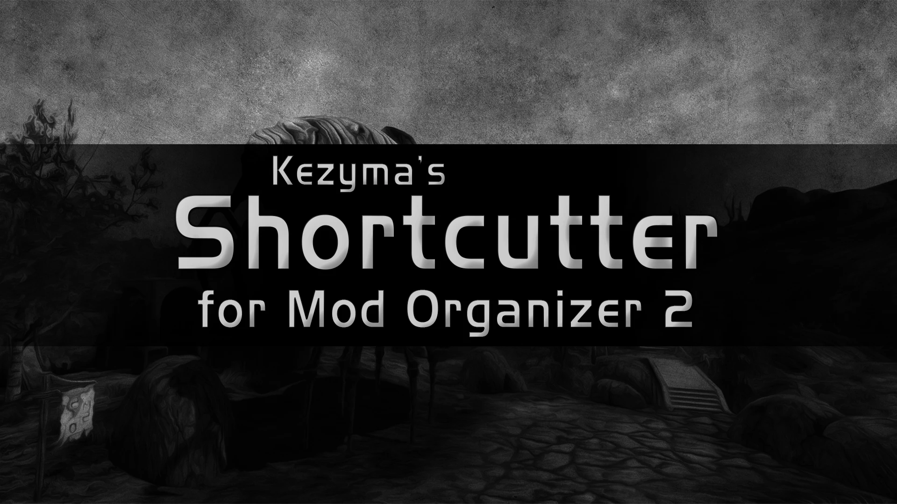
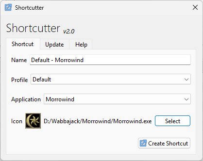

Shortcutter is a plugin for Mod Organizer 2 that allows users to create profile-specific desktop shortcuts to launch applications through Mod Organizer.

## Table of Contents

- [Features](#features)
- [Installation](#installation)
- [Usage](#usage)
  - [Creating a Shortcut](#creating-a-shortcut)
  - [Custom Icons](#custom-icons)
- [How It Works](#how-it-works)
- [Settings](#settings)
- [Troubleshooting](#troubleshooting)
- [Uninstallation](#uninstallation)

## Features

- Create profile-specific shortcuts to launch apps with a specific profile
- Create instance-specific shortcuts that auto-switch to the correct instance (non-portable only)
- Pick custom icons for shortcuts from .ico or .exe files
- Auto-naming based on profile and application
- Run different mod configurations without opening Mod Organizer first

## Installation

Download Shortcutter from [Nexus Mods](https://www.nexusmods.com/skyrimspecialedition/mods/59827) or [GitHub](https://github.com/Kezyma/ModOrganizer-Plugins/releases/tag/shortcutter).

Extract the `shortcutter` folder from the zip file and place it in Mod Organizer's plugins folder:
- Example: `C:\Mod Organizer\plugins\shortcutter\`

Inside the folder you should find:
- A `shared` folder
- A `shortcutter` folder
- A file called `__init__.py`

Shortcutter will start the next time you run Mod Organizer.

Alternatively, install through [Plugin Finder](pluginfinder.md) or use the [Mod Organizer Setup Tool](https://www.nexusmods.com/site/mods/599).

## Usage

Open Shortcutter from the Tools menu in Mod Organizer.

### Creating a Shortcut

1. **Select Application**: Choose the executable to run from the dropdown
2. **Select Profile**: Choose the profile to use when the shortcut is launched
3. **Shortcut Name**: Edit the name (defaults to "Profile - Application")
4. **Select Icon** (optional): Browse for a custom icon file
5. Click **Create** to generate the shortcut on your desktop

### Custom Icons

Click the browse button to select a custom icon:
- **.ico files**: Used directly as the shortcut icon
- **.exe files**: The embedded icon is extracted and used

A preview of the selected icon is shown before creating the shortcut. If no custom icon is selected, the default application icon will be used.

## How It Works

Shortcuts created by Shortcutter launch Mod Organizer with command-line parameters that specify the profile and application to run. When you use the shortcut:
1. Mod Organizer opens with the selected profile active
2. The chosen application launches immediately
3. You can play without manually selecting profiles or applications

Instance-specific shortcuts only work with non-portable Mod Organizer installations.

## Settings

| Setting | Default | Description |
|---------|---------|-------------|
| `enabled` | `true` | Enables or disables Shortcutter |

## Troubleshooting

### Where is my shortcut?

All generated shortcuts are placed on the desktop, or wherever Windows believes your desktop is located.

### Opening Mod Organizer defaults to the last instance that Shortcutter opened

The current Mod Organizer instance is stored in the Windows registry. When Shortcutter launches from a shortcut, the instance in the registry is changed. Unfortunately, there is no way to change it back automatically, so this must be done manually if you want to switch instances.

### Shortcut doesn't work

Ensure that:
- The profile still exists in Mod Organizer
- The application still exists in the profile's executable list
- Mod Organizer hasn't been moved to a different location

### Icon not showing correctly

Windows caches shortcut icons. Try refreshing your desktop or restarting Explorer if a new icon doesn't appear immediately.

## Uninstallation

To remove Shortcutter, delete:
- `plugins\shortcutter\`
- `plugins\data\shortcutter\`

If Mod Organizer is at `C:\Mod Organizer\`, delete:
- `C:\Mod Organizer\plugins\shortcutter\`
- `C:\Mod Organizer\plugins\data\shortcutter\`
