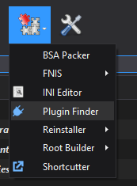
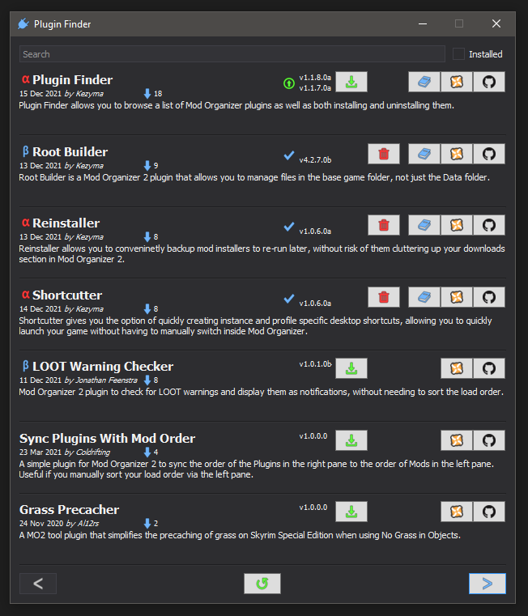

# Plugin Finder
## v1.1.*

### Introduction
Plugin Finder allows you to browse a list of Mod Organizer plugins as well as both installing and uninstalling them.

### Installation
Copy the pluginfinder folder to Mod Organizer's plugins folder. If Mod Organizer is installed at `D:\MO\`, the plugins folder will be located at `D:\MO\plugins\`
Make sure that `__init__.py` is located at `D:\MO\plugins\pluginfinder\` and not directly copied into the plugins folder itself.

### Uninstallation
Delete the following folders from Mod Organizer, assuming Mod Organizer is installed at `D:\MO\`:
`D:\MO\plugins\pluginfinder\`
`D:\MO\plugins\data\pluginfinder\`

### Usage
A new item will appear in the tools menu of Mod Organizer. This will open up a list of plugins.

*Location of Plugin Finder in tools menu*



*Plugin Finder browser window*



The documentation, Nexus and Github buttons open links to the relevant pages for the plugin. 
The green download button will download and install the plugin to Mod Organizer.
The red minus button will uninstall the plugin from Mod Organizer.

Plugins can be searched by name and can be filtered to show only installed plugins.
At the bottom, arrow buttons on either side can be used to browse various pages and the refresh button in the middle will clear all cached data and reload it. 
By default, data will be updated once per day, as it is needed.

After installing or uninstalling plugins, Mod Organizer will restart.

### Settings

#### enabled (default: true)
Determines whether the Plugin Finder plugin is enabled in Mod Organizer.

### Adding Plugins
If you want a plugin added to Plugin Finder, you will need to create a json file in your github repository following this template;
```
{
  "Name": "Plugin Name",
  "Author": "Author Name",
  "Description": "A short description of your plugin.",
  "NexusUrl": "URL to the Nexus page for your plugin.",
  "GithubUrl": "URL to the Github page for your plugin.",
  "DocsUrl": "URL to the documentation or readme for your plugin.",
  "Versions": [
    {
      "Version": "Version of this release.",
      "Released": "Date of this release, in format yyyy-MM-dd",
      "MinSupport": "Minimum version of Mod Organizer that this release is known to work for. Displays a warning when installing to earlier versions.",
      "MaxSupport": "Maximum version of Mod Organizer that this release is known to work for. Displays a warning when installing to newer versions.",
      "MinWorking": "Minimum version of Mod Organizer that this release works for. Prevents installation to earlier versions.",
      "MaxWorking": "Maximum version of Mod Organizer that this release works for. Prevents installation to newer versions.",
      "DownloadUrl": "Direct download URL of the zipped release of this plugin",
      "PluginPath": [ "Array of paths, relative to the zipped download. Any files or folders specified will be copied to the Mod Organizer plugins folder on install." ],
      "LocalePath": [ "Array of paths, relative to the zipped download. Any files or folders specified will be copied to the Mod Organizer translations folder on install." ],
      "DataPath": [ "Array of paths, relative to the Mod Organizer plugins folder. Any files or folders specified will be deleted when the plugin is uninstalled." ],
      "ReleaseNotes": [ "Array of release notes for this release." ]
    }
  ]
}
```

And you can use the json file for Root Builder as an example;
```
{
  "Name": "Root Builder",
  "Author": "Kezyma",
  "Description": "Root Builder is a Mod Organizer 2 plugin that allows you to manage files in the base game folder, not just the Data folder.",
  "NexusUrl": "https://www.nexusmods.com/skyrimspecialedition/mods/31720",
  "GithubUrl": "https://github.com/Kezyma/ModOrganizer-Plugins",
  "DocsUrl": "https://github.com/Kezyma/ModOrganizer-Plugins/blob/main/readme/rootbuilder/readme.md",
  "Versions": [
    {
      "Version": "4.2.7b",
      "Released": "2021-12-13",
      "MinSupport": "2.4.2",
      "MaxSupport": "2.5.0.0-qt6dev2",
      "MinWorking": "",
      "MaxWorking": "",
      "ReleaseNotes": [ "Added basic support for Mod Organizer 2 v2.5.0" ],
      "DownloadUrl": "https://github.com/Kezyma/ModOrganizer-Plugins/releases/download/rootbuilder/rootbuilder.4.2.7.zip",
      "PluginPath": [ "rootbuilder" ],
      "LocalePath": [],
      "DataPath": [ "data/rootbuilder" ]
    }
  ]
}
```

Once your json file is on github (or somewhere else), you'll need to either;
- Open a pull request adding your file to the [plugin directory](https://github.com/Kezyma/ModOrganizer-Plugins/blob/main/directory/plugin_directory.json) 
- Open an issue, providing your plugin name and link to your json file.
- Contact me on Discord and I can add your plugin to the repository. My username is Kezyma#7969

You will need to record new releases in your json file so that Plugin Finder can keep up to date with the latest version of your plugin!

## Other Plugins
#### [Root Builder](https://www.nexusmods.com/skyrimspecialedition/mods/31720), [Reinstaller](https://www.nexusmods.com/skyrimspecialedition/mods/59292), [Shortcutter](https://www.nexusmods.com/skyrimspecialedition/mods/59827)
