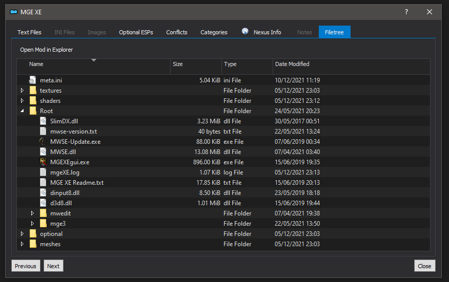
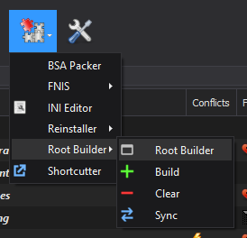
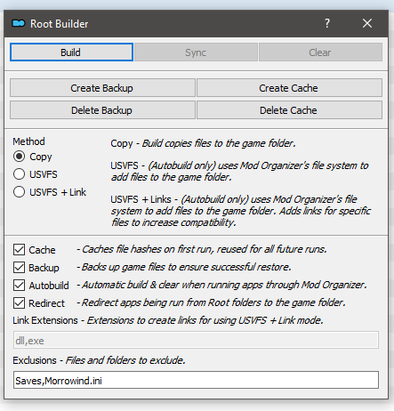

# Root Builder
## v4.2.*

### Introduction
Root Builder is a Mod Organizer 2 plugin that allows you to manage files in the base game folder, not just the Data folder. It is designed to allow you to keep all of your modding inside Mod Organizer and leave the game folder completely untouched. 

### Installation
If you have any version of Root Builder earlier than version 4, run a clear operation and uninstall that version.

Copy the rootbuilder folder to Mod Organizer's plugins folder. If Mod Organizer is installed at `D:\MO\`, the plugins folder will be located at `D:\MO\plugins\`
Make sure that `__init__.py` is located at`D:\MO\plugins\rootbuilder\` and not directly copied into the plugins folder itself.

### Uninstallation
To remove Root Builder entirely, first run a Clear operation to clean up any installed files and return your game to a vanilla state.

Delete the following folders from Mod Organizer, assuming Mod Organizer is installed at `D:\MO\`:
`D:\MO\plugins\rootbuilder\`
`D:\MO\plugins\data\rootbuilder\`

### Mod Setup
When installing mods that contain files that need to go in the base game folder, you will need to restructure the mod to add a new Root folder.

*MGE XE for Morrowind, packed for Root Builder*

For example, if your original mod is packaged like this;
	
	SomeModDll.dll
	SomeModExe.exe
	Data\SomeModEsp.esp
	Data\Textures\ASpecialTexture.dds
	Data\Meshes\VeryPrettyModel.nif

SomeModDll.dll and SomeModExe.exe both need to go in the base game folder, while all the others are standard meshes, textures and an esp that go in the data folder like normal.
To repackage this mod to work with Root Builder, it'll need to be structured like this inside Mod Organizer, with SomeModDll.dll and SomeModExe.exe inside a Root folder, alongside the textures, meshes and esp;
	
	Root\SomeModDll.dll
	Root\SomeModExe.exe
	SomeModEsp.esp
	Textures\ASpecialTexture.dds
	Meshes\VeryPrettyModel.nif

With this structure, the meshes, textures and esp will be recognised by Mod Organizer as normal, while SomeModExe.exe and SomeModDll.dll will be recognised by Root Builder.

If a mod only contains Root files, Mod Organizer will sometimes warn you that the mod isn't packed correctly or contains no files. You can safely ignore this warning.

If your mod contains an exe file that you need to add to Mod Organizer, you have two options;
1. You can add the exe directly from the mod folder itself, when you run it, Root Builder will detect that it is in a root mod and will switch to running it from the game folder. This does NOT support running the exe with arguments, if you need arguments, use the other method.
2. Manually run a build (see below), then add the exe to Mod Organizer from the game folder like normal, then run a clear (see below).

### Usage
With Root Builder's default settings, you don't need to do anything else, when you run an app through Mod Organizer, all the Root files will be copied across to your game before it runs and the game will be restored to its original state when the app closes. Any new files or changes to the vanilla game will be moved to the overwrite folder in Mod Organizer.

A new item will appear in the tools menu of Mod Organizer to support Root Builder, this includes a menu with utilities and settings and options to run the main functions of Root Builder.

*Location of Root Builder tools menu*

*Root Builder settings menu*

#### Build
When a build runs, the following happpens;
- The current game folder is hashed and the data recorded.
	- If data from a previous build exists, it will be loaded instead.
	- If cache data exists and previous build data does not, it will be loaded instead.
- If cache(default=true) is enabled , the data will be saved as a cache for all future runs.
	- If not, any existing cache file is deleted.
- If backup(default=true) is enabled , any base game files that are not currently backed up, will be.
	- If backup isn't enabled, any any game files that conflict with mod files in root folders will be backed up.
- If usvfsmode(default=false) and linkmode(default=false) are enabled , any valid files will be linked to the game folder and the list recorded.
- Otherwise, all mod files in the root folder are copied to the game folder.

#### Sync
Sync only has an effect if usvfs mode is disabled and a build has been run.

When a sync runs, the following happens;
- Data from the last build is loaded.
- Each file in the game folder is checked.
	- If it came from a mod, it's compared with the original file and will overwrite it if changed.
	- If it came from the base game, it's compared with the original file and the file will be copied to Mod Organizer's overwrite folder if it has changed.
	- If it's a new file, it will be copied to Mod Organizer's overwrite folder.
- Data for the current build is updated to include references to any files that were copied to the overwrite folder and any changed hashes are updated.

Please note, if you run a sync that copies files to overwrite and then you move them to a mod, you must run build again or Root Builder will think they are still in the overwrite folder and may copy them back there on the next sync or clear.

#### Clear
When a clear runs, the following happens;
- A Sync operation is run, to make sure any changes to the game files are not lost.
- If any files have been linked while linkmode(default=false) is enabled, the links in the game folder will be removed.
- Any files that have been copied across to the game folder will be deleted.
- Any base game files that have changed and also have a backup will be restored from the backup.
- If backup(default=true) is disabled, any backed up files will be deleted.
- Data for the last build is deleted.

Please ensure you ALWAYS run a clear operation before exiting Mod Organizer if you have previously run a build. If your game is updated while files from a build are still present in the game folder, Root Builder will assume those files are part of a new game update and treat them like vanilla game files in the future.

### Utilities

### Create Cache
If there is currently no cache file, the base game folder is hashed and saved.

### Delete Cache
If there is a cache file, it's deleted.

### Create Backup
Runs the backup operation.
- Vanilla game files are backed up.
	- If cache is enabled, the game file hashes will be cached.

### Delete Backup
Deletes any existing game file backups.

### Settings

#### enabled (default: true)
Determines whether the Root Builder plugin is enabled in Mod Organizer.

#### cache (default: true)
If enabled, on the first build being run, the hashes of the game folder will be cached. This is ideal if you have a fresh game installation or are confident that you do not plan on changing files in the game folder manually.

If disabled, if any cache already exists for the current game, it will be cleared on the next build.

#### backup (default: true)
If enabled, on the first build being run, the contents of the game folder will be backed up. This is ideal if you have a fresh game installation or are confident that you do not plan on changing files in the game folder manually.

If disabled, Root Builder will try to identify any conflicts between your installed mods and the game folder and back only those conflicts up.

If disabled, any existing backup will be deleted on the next clear.

#### autobuild (default: true)
If enabled, whenever you run an application through Mod Organizer, a build will be run before the application and a clear will be run when the application closes. 
If you disable this setting, you will need to manually use the build and clear functions.

#### redirect (default: true)
If enabled, when running an application through Mod Organizer, if that application is in a root folder within a mod and also exists in the game folder, it will redirect the application to launch from the game folder instead.
If you disable this, make sure to update any apps currently added to Mod Organizer to point to an exe within the game folder itself.

#### usvfsmode (default: false)
Requires autobuild to be enabled.

If enabled, instead of copying files to and from the game folder, Root Builder will utilise Mod Organizer's usvfs to handle root files. This will only work with autobuild since it is handled when you launch an application through Mod Organizer. Do not attempt to manually build, sync or clear when using this mode. Make sure to run a clear before enabling/disabling this setting or unintentional results may occur.

Please note, this does not work with all game and mod combinations.

#### linkmode (default: false)
Requires usvfsmode and autobuild to be enabled.

If enabled, on top of using usvfs, Root Builder will create links in the game folder pointing to specific mod root files. This can improve the compatibility of usvfs mode.

Please note, this does not work with all game and mod combinations.

#### linkextensions (default: "exe,dll")
A comma separated list of file extensions that are valid for linking if linkmode is enabled.

#### exclusions (default: "Saves,Morrowind.ini")
A comma separated list of files and folders in the base game folder that will be ignored by Root Builder. Supports * as a wildcard.

Any mods that contain these files and folders will be ignored and skipped during build.

### Game Updates
If you have autobuild disabled, please ensure you always clear Root Builder before exiting Mod Organizer. As long as Root Builder is cleared when the game updates, everything will function as expected.
If your game updates while you have root files copied across you may notice base game files in your overwrite and the previous version being restored, to resolve this, do the following;
- Run a clear, this will clean up the game and (if backup is enabled) restore the previous version.
- Clear Mod Organizer's overwrite folder, this will get rid of the updated game files. 
- Delete Backup & Cache (if enabled), this will prevent the previous version of the game from being restored on clear.
- Re-update the game. If the version change was intentional (or an automated update), you will need to run it again before Root Builder next does a build.

## Other Plugins
#### [Root Builder](https://www.nexusmods.com/skyrimspecialedition/mods/31720), [Reinstaller](https://www.nexusmods.com/skyrimspecialedition/mods/59292), [Shortcutter](https://www.nexusmods.com/skyrimspecialedition/mods/59827)