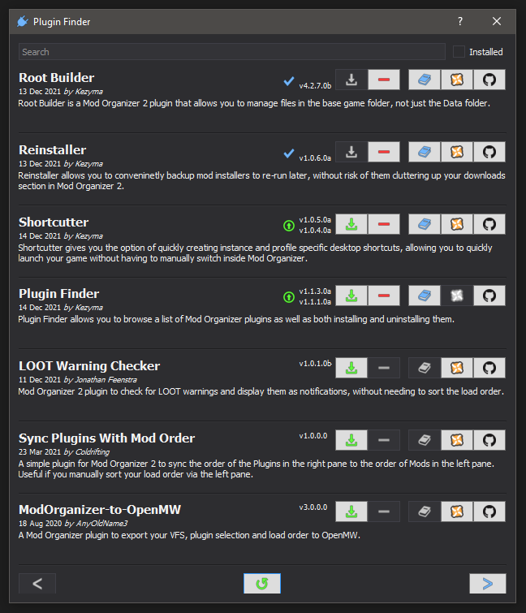

# Plugin Finder
## v1.1.*

### Introduction
Plugin Finder allows you to browse a list of Mod Organizer plugins as well as both installing and uninstalling them.

### Installation
Copy the pluginfinder folder to Mod Organizer's plugins folder. If Mod Organizer is installed at `D:\MO\`, the plugins folder will be located at `D:\MO\plugins\`
Make sure that `__init__.py` is located at `D:\MO\plugins\pluginfinder\` and not directly copied into the plugins folder itself.

### Uninstallation
Delete the following folders from Mod Organizer, assuming Mod Organizer is installed at `D:\MO\`:
`D:\MO\plugins\pluginfinder\`
`D:\MO\plugins\data\pluginfinder\`

### Usage
A new item will appear in the tools menu of Mod Organizer. This will open up a list of plugins.

*Location of Plugin Finder in tools menu*

*Plugin Finder browser window*

The documentation, Nexus and Github buttons open links to the relevant pages for the plugin. 
The green download button will download and install the plugin to Mod Organizer.
The red minus button will uninstall the plugin from Mod Organizer.

Plugins can be searched by name and can be filtered to show only installed plugins.
At the bottom, arrow buttons on either side can be used to browse various pages and the refresh button in the middle will clear all cached data and reload it. 
By default, data will be updated once per day, as it is needed.

After installing or uninstalling plugins, Mod Organizer will restart.

### Settings

#### enabled (default: true)
Determines whether the Plugin Finder plugin is enabled in Mod Organizer.

## Other Plugins
#### [Root Builder](https://www.nexusmods.com/skyrimspecialedition/mods/31720), [Reinstaller](https://www.nexusmods.com/skyrimspecialedition/mods/59292), [Shortcutter](https://www.nexusmods.com/skyrimspecialedition/mods/59827)
