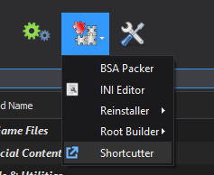
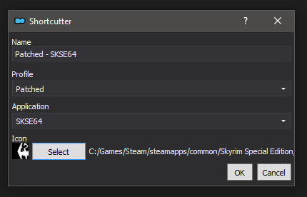

# Shortcutter
## v1.0.*

### Introduction
Shortcutter gives you the option of quickly creating instance and profile specific desktop shortcuts, allowing you to quickly launch your game using different profiles without having to manually switch inside Mod Organizer.

### Installation
Copy the shortcutter folder to Mod Organizer's plugins folder. If Mod Organizer is installed at `D:\MO\`, the plugins folder will be located at `D:\MO\plugins\`
Make sure that `__init__.py` is located at `D:\MO\plugins\shortcutter\` and not directly copied into the plugins folder itself.

### Uninstallation
Delete the following folders from Mod Organizer, assuming Mod Organizer is installed at `D:\MO\`:
`D:\MO\plugins\shortcutter\`
`D:\MO\plugins\data\shortcutter\`

### Usage
A new item will appear in the tools menu of Mod Organizer named Shortcutter. Launching this opens a window to generate shortcuts.
Select your chosen profile and application, then select an icon and give your shortcut a name. Clicking Ok adds the shortcut to your desktop.

*Shortcutter menu item*

*Shortcutter window*

If you are using a global Mod Organizer instance, the shortcut will be created to launch that instance specifically.
If you are using a portable Mod Organizer instance, the shortcut will not be instance specific and will stop working if your last opened Mod Organizer instance was not portable. 
If portable shortcuts stop working, open Mod Organizer, switch to the portable profile and close it again, which should resolve the issue.

### Settings

#### enabled (default: true)
Determines whether the Shortcutter plugin is enabled in Mod Organizer.

## Other Plugins
#### [Root Builder](https://www.nexusmods.com/skyrimspecialedition/mods/31720), [Reinstaller](https://www.nexusmods.com/skyrimspecialedition/mods/59292), [Shortcutter](https://www.nexusmods.com/skyrimspecialedition/mods/59827)
